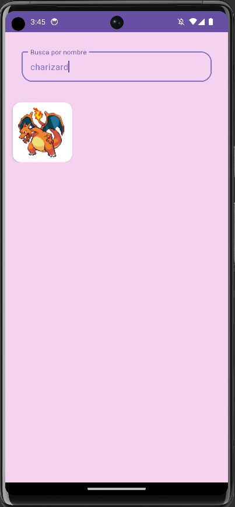

# Pokedex - ¡Atrápalos Todos!

## Descripción

Esta pokedex es una aplicación Android que te permite explorar información detallada sobre los primeros 100 Pokémon. La aplicación utiliza la API Rest de [PokeAPI](https://pokeapi.co/) para obtener datos precisos y actualizados sobre estos adorables monstruos de bolsillo.

## Capturas de Pantalla

 

## Créditos

- **PokeAPI:** Agradecemos a [PokeAPI](https://pokeapi.co/) por proporcionar la fuente de datos para esta aplicación.

## Licencia

Este proyecto está bajo la Licencia MIT. Consulta el archivo [LICENSE](./LICENSE) para obtener más detalles.

